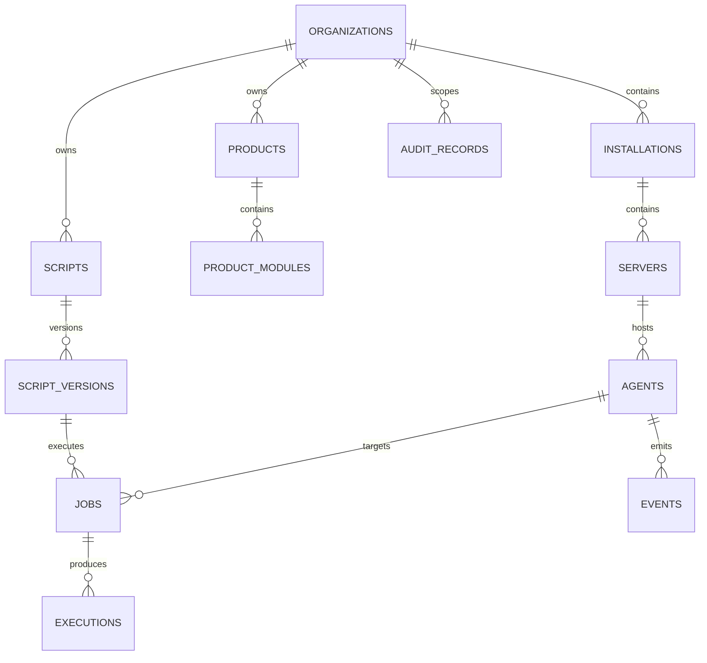

# BRAVO Script Monitor — Database Design

**Version:** 0.2.0-alpha  
**Status:** Draft for implementation

## 1. Purpose

PostgreSQL is the system of record for BSM configuration, inventory, execution history, events, audit data and agent state. Redis is used only for transient coordination, caching and queues; it is not a source of truth.

## 2. Conventions

- Primary keys are UUID v4 values.
- Timestamps are stored as timezone-aware UTC values.
- Mutable entities include `created_at` and `updated_at`.
- Business deletion uses `archived_at` or an explicit status where historical integrity matters.
- JSONB is allowed for extensible metadata, parameters and inventory snapshots, but not as a replacement for core relational fields.
- Foreign keys are indexed when used for filtering or joins.
- Identifiers exposed through the API are stable and never reused.

## 3. Initial domain model

## 4. Tables

### organizations
Tenant boundary. Stores customer or internal BRAVOSOFT organization records.

### installations
Logical deployment of one or more BRAVOSOFT products at an organization.

### servers
Managed Windows or Linux hosts. Stores normalized identity and latest inventory snapshot.

### agents
Runtime agent identity, version, status, capabilities and heartbeat state. Secrets and refresh tokens are not stored in plaintext.

### products and product_modules
Product catalogue and installed functional modules.

### scripts and script_versions
Logical script metadata is separated from immutable versions. A job always references a specific script version.

### jobs
Requested work unit. Stores target, requested parameters, scheduling metadata and lifecycle state.

### executions
One execution attempt of a job, including timing, result state, exit code and output summary.

### events
Operational events emitted by agents or server components.

### audit_records
Append-only record of security-sensitive and administrative actions.

## 5. Integrity rules

- Organization slug is globally unique.
- Installation code is unique within its organization.
- Server hostname is unique within an installation.
- Agent identity is unique per server.
- Product code is unique within an organization.
- Product module code is unique within a product.
- Script name is unique within an organization.
- Script version number is unique within a script.
- Execution attempt number is unique within a job.
- Audit records are append-only at the application layer.

## 6. Retention and partitioning

MVP uses ordinary tables. Before production scale testing, `events`, `executions` and `audit_records` must be evaluated for monthly range partitioning by `created_at`. Retention must be configurable per organization, with a default target of 365 days for operational events and no automatic deletion of audit records without an approved policy.

## 7. Migration policy

- Alembic is the only supported schema migration mechanism.
- Every migration must support a deterministic upgrade.
- Destructive changes require an ADR, backup instructions and a staged migration plan.
- Application startup does not automatically run production migrations.
